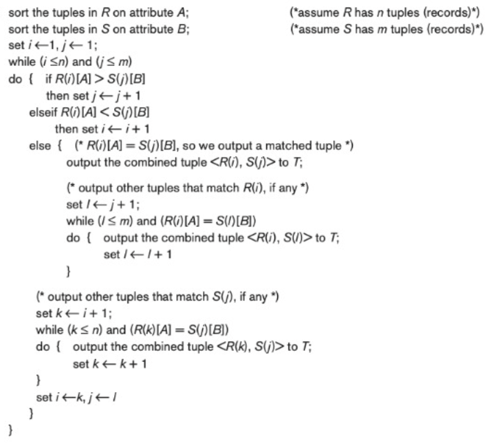

# Data Systems
## Project Phase 1
## Team 48

### Commands
- SORT
    - Syntax: `SORT <table_name> BY <column_name1, column_name2,..., column_namek> IN <ASC|DESC, ASC|DESC,..., ASC|DESC>`
    - Implementation:
        - The pages are first sorted individually : internal sorting
        - Buffer size is stored in variable BUFFER_SIZE
        - Number of disk blocks accessed : BUFFER_SIZE - 1 and 1 for the disk block of merged file
        - Number of passes required is pre-calculated using the formula ceil((double)log(this->blockCount) / log(BUFFER_SIZE - 1));
        - The Merge phase is divided into 2 parts
            - By default, it is assumed that 1 pass of merging will be done for all the pages where each block size is one page.
            - If more than one pass is required, then one block will have multiple pages
                - A priority queue with comparator is used to get the rows from pages and merge and store into multiple pages according to the original page sizes of the table
        - After each pass, the page files of table are removed from the pool because now the pages are updated.
        - Pages of the table are renamed accordingly
        - Finally the sorted pages are exported to the CSV.

        - Implemented Here: [sort.cpp](../src/executors/sort.cpp) and [table.cpp](../src/table.cpp)
- ORDER BY
    - Syntax: `<new_table> <- ORDER BY <attribute> ASC|DESC ON <table_name>`
    - Implementation:
        - It is an extension of the sorting methodology with the sorting happening on only one column.
        - A new relation is created with the given attribute column sorted based on the given order type.
        - Implemented Here: [order.cpp](../src/executors/order.cpp)
- JOIN
    - Syntax: `<new_relation_name> <- JOIN <tablename1>, <tablename2> ON <column1><bin_op> <column2>`
    - Implementation: 
        - The given relations are first sorted based on the given attributes in which they need to be joined.
        - Then the joining happens based on the sort-merge-join algorithm.
        - 
        - Implemented Here: [join.cpp](../src/executors/join.cpp)
- GROUP BY
    - Syntax : `<new_table> <- GROUP BY <grouping_attribute> FROM <table_name> HAVING <aggregate(attribute)> <bin_op> <attribute_value> RETURN <aggregate_func(attribute)>`
    - Implementation: 
        - Sorting of the given relation based on the given aggregate attribute.
        - Iterating over the attribute and checking the HAVING condition.
        - Iterating over the computed subset and placing the desired return value into the new table.
        - Implemented Here: [groupBy.cpp](../src/executors/groupBy.cpp)

### Learnings from the Project:
- Optimized sorting and searching strategies
- Query based iteration and design selection
- Data Consistency and other ACID Properties.

### Project Contributors:
- Madhusree
    - Syntactic and Semantic Parser for SORT command
    - External Merge Sort
    - Report
- Anurag
    - Internal Sort Operation
    - Join Function
    - Group By Function
    - Report
- Sanya
    - Order Function
