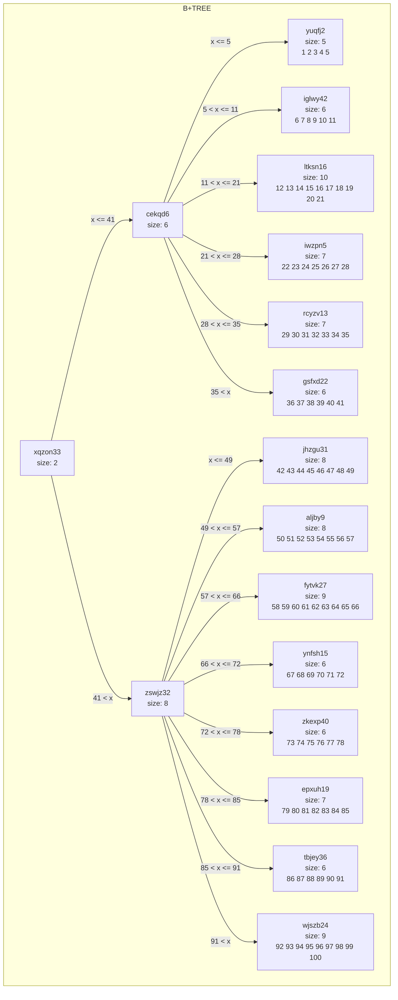

```mermaid
graph TD
subgraph B+TREE
xqzon33[xqzon33<br/>size: 2<br/>]
cekqd6[cekqd6<br/>size: 6<br/>]
yuqfj2[yuqfj2<br/>size: 5<br/>1 2 3 4 5 ]
cekqd6-->|x <= 5|yuqfj2
iglwy42[iglwy42<br/>size: 6<br/>6 7 8 9 10 11 ]
cekqd6-->|5 < x <= 11|iglwy42
ltksn16[ltksn16<br/>size: 10<br/>12 13 14 15 16 17 18 19 20 21 ]
cekqd6-->|11 < x <= 21|ltksn16
iwzpn5[iwzpn5<br/>size: 7<br/>22 23 24 25 26 27 28 ]
cekqd6-->|21 < x <= 28|iwzpn5
rcyzv13[rcyzv13<br/>size: 7<br/>29 30 31 32 33 34 35 ]
cekqd6-->|28 < x <= 35|rcyzv13
gsfxd22[gsfxd22<br/>size: 6<br/>36 37 38 39 40 41 ]
cekqd6-->|35 < x|gsfxd22
xqzon33-->|x <= 41|cekqd6
zswjz32[zswjz32<br/>size: 8<br/>]
jhzgu31[jhzgu31<br/>size: 8<br/>42 43 44 45 46 47 48 49 ]
zswjz32-->|x <= 49|jhzgu31
aljby9[aljby9<br/>size: 8<br/>50 51 52 53 54 55 56 57 ]
zswjz32-->|49 < x <= 57|aljby9
fytvk27[fytvk27<br/>size: 9<br/>58 59 60 61 62 63 64 65 66 ]
zswjz32-->|57 < x <= 66|fytvk27
ynfsh15[ynfsh15<br/>size: 6<br/>67 68 69 70 71 72 ]
zswjz32-->|66 < x <= 72|ynfsh15
zkexp40[zkexp40<br/>size: 6<br/>73 74 75 76 77 78 ]
zswjz32-->|72 < x <= 78|zkexp40
epxuh19[epxuh19<br/>size: 7<br/>79 80 81 82 83 84 85 ]
zswjz32-->|78 < x <= 85|epxuh19
tbjey36[tbjey36<br/>size: 6<br/>86 87 88 89 90 91 ]
zswjz32-->|85 < x <= 91|tbjey36
wjszb24[wjszb24<br/>size: 9<br/>92 93 94 95 96 97 98 99 100 ]
zswjz32-->|91 < x|wjszb24
xqzon33-->|41 < x|zswjz32
end
```

```mermaid
graph LR
subgraph UNORDERED_HEAP
lrfkq1[lrfkq1<br/>size: 4<br/>13 41 33 2 ]
rozoe3[rozoe3<br/>size: 4<br/>49 48 21 93 ]
lrfkq1-->rozoe3
ewrxa4[ewrxa4<br/>size: 4<br/>1 11 66 83 ]
rozoe3-->ewrxa4
bmtey7[bmtey7<br/>size: 4<br/>28 56 62 17 ]
ewrxa4-->bmtey7
wgtur8[wgtur8<br/>size: 4<br/>15 4 79 22 ]
bmtey7-->wgtur8
fwtjk10[fwtjk10<br/>size: 4<br/>68 59 23 95 ]
wgtur8-->fwtjk10
elmzi11[elmzi11<br/>size: 4<br/>24 35 25 18 ]
fwtjk10-->elmzi11
hprso12[hprso12<br/>size: 4<br/>32 31 37 65 ]
elmzi11-->hprso12
yliuz14[yliuz14<br/>size: 4<br/>78 57 12 3 ]
hprso12-->yliuz14
qytsi17[qytsi17<br/>size: 4<br/>92 74 70 27 ]
yliuz14-->qytsi17
jrwgw18[jrwgw18<br/>size: 4<br/>77 87 42 91 ]
qytsi17-->jrwgw18
krbcr20[krbcr20<br/>size: 4<br/>99 63 8 52 ]
jrwgw18-->krbcr20
idkxi21[idkxi21<br/>size: 4<br/>54 30 84 45 ]
krbcr20-->idkxi21
cdzgg23[cdzgg23<br/>size: 4<br/>100 29 96 14 ]
idkxi21-->cdzgg23
qchst25[qchst25<br/>size: 4<br/>82 34 71 88 ]
cdzgg23-->qchst25
wboec26[wboec26<br/>size: 4<br/>53 60 97 86 ]
qchst25-->wboec26
gjqlr28[gjqlr28<br/>size: 4<br/>61 47 50 76 ]
wboec26-->gjqlr28
tnkbb29[tnkbb29<br/>size: 4<br/>39 36 98 43 ]
gjqlr28-->tnkbb29
mqksp30[mqksp30<br/>size: 4<br/>90 19 20 40 ]
tnkbb29-->mqksp30
blwpd34[blwpd34<br/>size: 4<br/>64 10 85 6 ]
mqksp30-->blwpd34
fmcqr35[fmcqr35<br/>size: 4<br/>89 75 9 51 ]
blwpd34-->fmcqr35
vmver37[vmver37<br/>size: 4<br/>55 69 94 44 ]
fmcqr35-->vmver37
xpopm38[xpopm38<br/>size: 4<br/>46 72 26 80 ]
vmver37-->xpopm38
tamzs39[tamzs39<br/>size: 4<br/>7 38 73 81 ]
xpopm38-->tamzs39
xhxum41[xhxum41<br/>size: 4<br/>67 58 5 16 ]
tamzs39-->xhxum41
end
```
